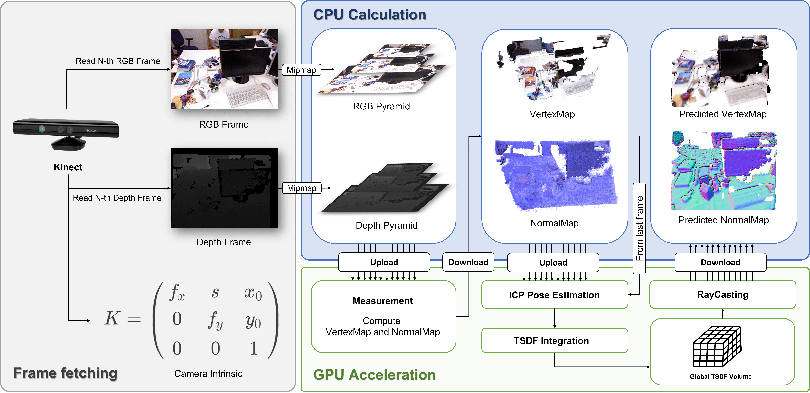
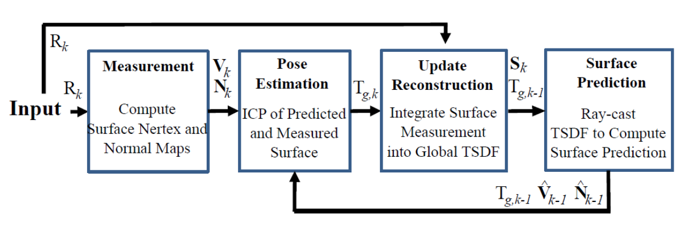
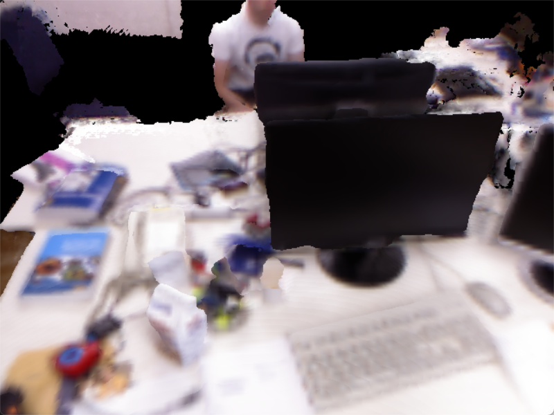
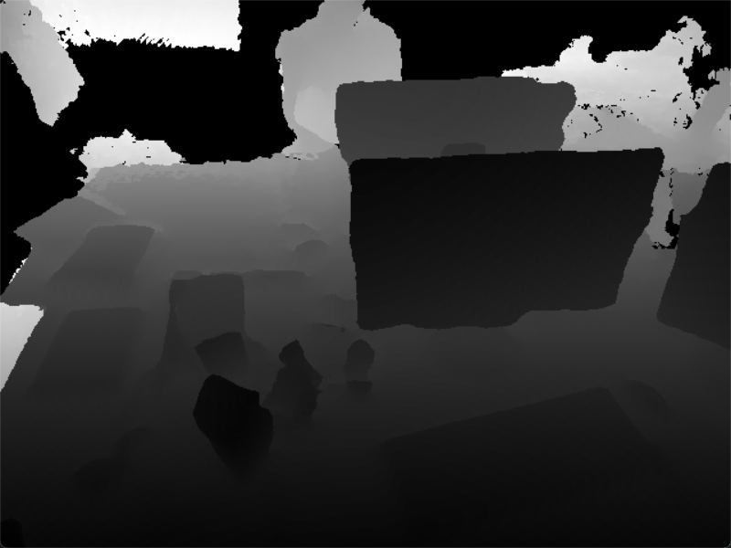
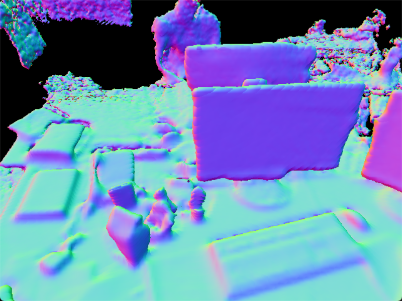

# KinectFusionGPU
This is a simplified [KinectFusion](https://www.microsoft.com/en-us/research/wp-content/uploads/2016/02/ismar2011.pdf)[Newcombe et.al, 2011] implmentation made for learning purpose. 

**Warining**: The project is still under development, some implementations are not the same as in the paper.

## Dataset
[TUM RGBD dataset](https://vision.in.tum.de/data/datasets/rgbd-dataset/download) is used.

## Pipeline

This implementation also follows the original paper to divide the full process into four sub-stages which are:

- SurfaceMesurement
- PoseEstimation
- SurfaceReconstruction
- SurfacePrediction
  


### SurfaceMeasurement
In this phase, we will get the RGB frame as well as the depth frame from dataset. ~~A pyramid mipmap will be set up based on the frame pair.~~(still not implmented) The vertex map and normal map will be computed on every pyramid level. 

### PoseEstimation 
We can get last frame by reading the frame generated from last SurfacePrediction. Also vertex map and normal map will be calculated for the last frame.
With the VN-map of last frame and current frame all given, we can perform the ICP algorithm to find a pose whihc aligns two point cloud best.

### SurfaceReconstruction 
As the pose is now available, we can use the pose to integrate the current frame into the global TSDF. Hence the depth and colour information will be fused into global TSDF with respectively weight.

### SurfacePrediction
A ray will be casted into the global TSDF to retrieve the RGB frame and the depth frame, and save them for next step PoseEstimation.

## Result
 |  |   SurfaceMeasurement   |  PoseEstimation  |  SurfaceReconstruction |  SurfacePrediction  | Sum |
 | :----: | :-----: | :-----: | :-----: | :-----: |:-----: |
 | Time for one frame (miliseconds) | 2.1123 | ~~0.0013~~ | 0.0153 | 3.5453 | 5.6729 |

Since the ICP is still not implemented, for now we have the processing time for single frame is about 6 miliseconds, assume frame per second is 30. Hence the objective is:

$30 \times (5.6729 +  \text{T}_{ICP}) \lt 1000$

We should finish the ICP within $327.66$ miliseconds.

Here are some reconstruction result derived with groundtruth pose.

| RGB | Depth | Normal |
| :-: | :-:| :-:|
||  | |
## Dependencies

- [OpenCV](https://opencv.org/) Vision library for image processing
- [Eigen](https://eigen.tuxfamily.org/index.php?title=Main_Page) Matrix computation library
- [OpenCL](https://www.khronos.org/opencl/) GPU parallel computation library
- [PCL](https://pointclouds.org/) Point Cloud library for executing ICP on CPU

## Get Started
I recommend to use vcpkg to manage our libraries, which is a package manager tool just like the pip for Python, maven for Java or npm for JavaScript. It's really convenient to use it to make our lives easier from building a bunch of related dependencies and so on. 

At first, you need to install vcpkg. You can find the installation tutorial [here](https://vcpkg.io/en/getting-started.html).

And then you'll need to install our dependencies.

For now, we only use Eigen, OpenCV, PCL, OpenCL.

- `vcpkg install eigen3`
- `vcpkg install opencv`
- `vcpkg install pcl`
- `vcpkg install opencl`

> For Windows please add suffix `:x64-windows`

After installing these two libraries, you should be able to build the project by using Cmake.

**You May Change CXX Standard of the VS project manually.**

**Before Building:** Dont forget to change the path to your vcpkg in [`CmakeLists.txt`](CMakeLists.txt) at ***Line 4***.

## ToDo
- [x] ~~DataLoader for loading data~~
- [x] ~~Compile OpenCL kernels~~
- [x] ~~Implementation of CPU based PointCloud Generation (Backprojection)~~
- [x] ~~Implementation of SurfaceMesurement~~
- [x] ~~Implementation of PCL based ICP~~
- [ ] Implementaiton of Corase-To-Fine ICP
- [ ] Implementation of GPU based ICP
    - [Math Background](https://github.com/DreamWaterFound/KinectFusionAppLib_comments/blob/master/doc/%E3%80%90%E9%99%84%E4%BB%B6%E3%80%91%E5%88%98%E5%9B%BD%E5%BA%86-KinectFusion%E4%B8%ADPlane-to-point_ICP%E7%9A%84%E8%AE%A1%E7%AE%97%E6%8E%A8%E5%AF%BC.pdf)
    - [Reference Repo1](https://github.com/HanzhouLu/Parallel-Point-Cloud-Registration)
    - [Reference Repo2](https://github.com/nlamprian/ICP)
    - [Reference Repo3](https://github.com/chrdiller/KinectFusionLib)
- [x] ~~Implementation of SurfaceReconstructor (TSDF Integration)~~
- [x] ~~Implementation of SurfacePredictor (RayCasting)~~

## Result


....
To be done.

## Project Strcture
The project folder should look like as following.
```
.
├── data
│   └── rgbd_dataset_freiburg1_xyz
│       ├── depth
│       └── rgb
├── opencl
│   ├── SurfaceMeasurement.cl
│   ├── ...
│   └── Utils.cl
├── build
├── CMakeLists.txt
├── main.cpp
├── DataLoader.hpp
├── GPUProgramLoader.hpp
├── SurfacePredictor.hpp
├── ...
└── README.md
```
## License
MIT 
